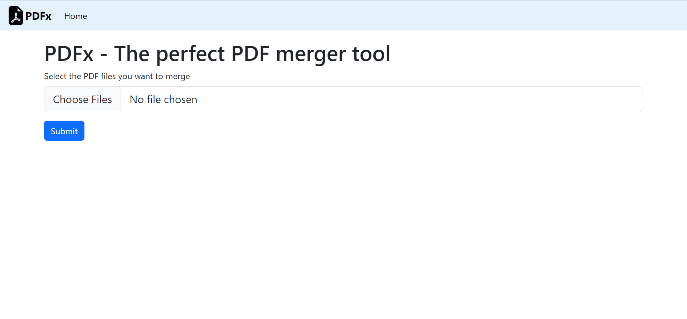

# PDF Merger Tool

### Introduction
The PDF Merger Tool is a web application built with Bootstrap and Node.js that allows users to merge multiple PDF files into a single PDF document conveniently. This tool streamlines the process of combining PDFs, making it easier for users to manage their documents.

## Screenshots


## Features
- Merge multiple PDF files into a single PDF document
- User-friendly web interface built with Bootstrap
- Fast and efficient PDF merging using Node.js
- CEasily customizable for further development

## Installation
1. Clone the repository:
   ```bash
   git clone https://github.com/Harshal-3558/PDF-Merger.git

2. Navigate to the project directory:

   ```bash
   cd PDF-Merger

3. Install the project dependencies:

   ```bash
   npm install

### Usage
Here are the steps to use the PDF Merger Tool:

1. Start the application as described in the installation instructions.

2. Click the "Upload PDF Files" button to select the PDF files you want to merge.

3. Once you have selected all the files, click the "Merge PDFs" button.

4. The tool will process and merge the PDF files into a single document.

5. You can then download the merged PDF document to your local machine using the provided download link.


## Tech Stack

- **Client:** Bootstrap CSS
  - Bootstrap was chosen for its responsive design and easy-to-use UI components, making it perfect for creating a user-friendly interface.
  
- **Server:** Node.js, Express
  - Node.js and Express were selected for their efficiency and ease of handling file uploads and PDF merging on the server-side. These technologies allow for fast and reliable processing of PDF files.

